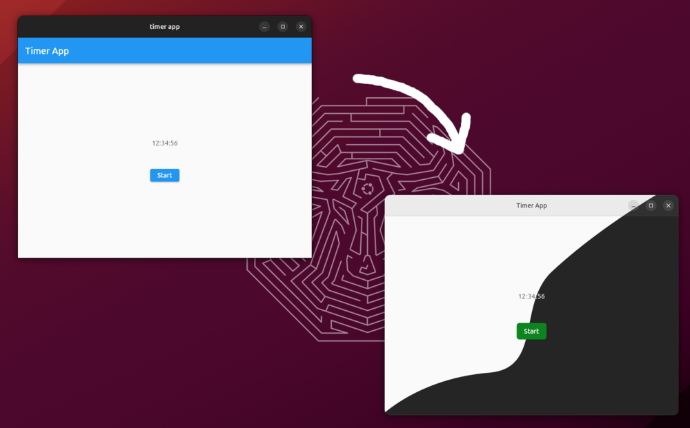
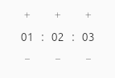

# How to Create Flutter Applications for the Ubuntu Desktop

Dennis Loose (Canonical) @ Ubuntu Summit 2023 in Riga, Latvia

## Outline
- Current state of Theming (Yaru + libhandy)
- Creating and testing a simple timer application (MVVM, provider)
- Interacting with desktop services (showing a notification)

---
# Sample application: Timer App
- HH:MM:SS display with '+' and '-' buttons to adjust time
- 'Start'/'Cancel' button
- Desktop notification when finished


To follow along:
```
git clone https://github.com/d-loose/flutter-workshop
git checkout <tag mentioned on slide>
```
- `timerapp` contains the Flutter project
- `slides` contains the slides you're seeing right now

---
# Quick & Dirty Flutter Setup

Installation:
```
sudo apt install -y clang cmake curl libgtk-3-dev ninja-build unzip xz-utils zip
git clone -b stable https://github.com/flutter/flutter $HOME/flutter
export PATH="$HOME/flutter/bin":"$PATH"
```

Check installation:
```
$ flutter doctor
[✓] Flutter (Channel stable, 3.13.9, on Ubuntu 23.10 6.5.0-10-generic, locale en_US.UTF-8)
...
[✓] Linux toolchain - develop for Linux desktop
    • Ubuntu clang version 16.0.6 (15)
    • cmake version 3.27.4
    • ninja version 1.11.1
    • pkg-config version 1.8.1
...
```

---
# Current State of Theming



---
## Using the Yaru Theme 

git tags: `bare-bones-ui`, `themed-app-skeleton`

Add the yaru package:
```
flutter pub add yaru
```

Wrap the `MaterialApp` in a new builder:
```dart
  Widget build(BuildContext context) {
    return YaruTheme(
      builder: (context, yaru, child) => MaterialApp(
        theme: yaru.theme,
        darkTheme: yaru.darkTheme,
        home: ...
      ),
    );
  }
```

---
## Using [`handy_window`](https://pub.dev/packages/handy_window) - Rounded  Bottom Corners
Add the `handy_window` package:
```
flutter pub add handy_window
```

In `CMakeLists.txt` add:
```
set(USE_LIBHANDY ON)
```

In `my_application.cc`:
- replace `gtk_application_window_new(..)` with `hdy_application_window_new()`, `gtk_window_set_application(..)`
- move `gtk_widget_show(..)` calls after `fl_register_plugins(..)`

---
## Using `YaruWindowTitleBar`
Add the `yaru_widgets` package:
```
flutter pub add yaru_widgets
```

In `my_application.cc`: remove GTK header bar.

Use Yaru's window title bar in the application:
```diff
 Widget build(BuildContext context) {
     return Scaffold(
-      appBar: AppBar(title: const Text('Timer App')),
+      appBar: const YaruWindowTitleBar(title: Text('Timer App')),
       body: ...
```

---
## Exercise: Adding a Simple View Model
git tag: `view-model-stub`

Following Flutter's [simple state management](https://docs.flutter.dev/data-and-backend/state-mgmt/simple) approach we can implement the view model using a [`ChangeNotifier`](https://docs.flutter.dev/data-and-backend/state-mgmt/simple#changenotifier):

```dart
class TimerModel with ChangeNotifier {
  final isRunning = false;
  final remaining = Duration.zero;

  void addTime(Duration duration) {
    // TODO
  }
}
```

Run the tests:
```
flutter test
```

---
## Exercise: Connecting the UI and the View Model
git tag: `ui-stub`
- Add a [`ChangeNotifierProvider`](https://docs.flutter.dev/data-and-backend/state-mgmt/simple#changenotifierprovider) to `TimerPage.create()`
- Read the remaining time from the view model provider and display the hours, minutes and seconds in their respective `_TimerColumn` widgets
  (i.e. make the "remaining time" test pass)


---
## Intermission: Widget Tests 101
### Mocking view models using [mockito](https://pub.dev/packages/mockito) or [mocktail](https://pub.dev/packages/mocktail):
```dart
class MockTimerModel extends Mock implements TimerModel {}

MockTimerModel createMockTimerModel({
  Duration remaining = Duration.zero,
  bool isRunning = false,
}) {
  final model = MockTimerModel();
  when(() => model.remaining).thenReturn(remaining);
  when(() => model.isRunning).thenReturn(false);
  return model;
}
```

---
### Simulating a specific model state using the mock:
```dart
testWidgets('remaining time', (tester) async {
  final mockTimerModel = createMockTimerModel(
    remaining: const Duration(hours: 12, minutes: 16, seconds: 43),
  );

  await tester.pumpYaruWidget( // helper that wraps the widget in YaruTheme and MaterialApp
    ChangeNotifierProvider<TimerModel>.value(
      value: mockTimerModel,
      child: const TimerPage(),
    ),
  );
...
```

`tester` can be used to setup the widget tree (`pumpWidget(..)`, ...) and to interact with it (`tap(..)`, `enterText(..)`, ...)

---
### ... and verifying that the UI is displayed correctly:
```dart
...
  for (final testCase in [
    (widgetKey: TimerPage.hoursColumnKey, value: '12'),
    (widgetKey: TimerPage.minutesColumnKey, value: '16'),
    (widgetKey: TimerPage.secondsColumnKey, value: '43'),
  ]) {
    expect(
      find.descendant(
        of: find.byKey(testCase.widgetKey),
        matching: find.text(testCase.value),
      ),
      findsOneWidget,
    );
  }
});
```

- `find` can be used to find widgets in the tree (`text(..)`, `byKey(..)`, ...)
- `expect()` can be used with different matchers for widgets (`findsOneWidget`, `findsNothing`, ...)

---
## Exercise: Connecting the UI and the View Model (continued)
- Add "+" and "-" buttons to the columns to adjust the time.
  
- Write your own test! You can use [`verify()`](https://pub.dev/documentation/mocktail/latest/mocktail/verify.html) to verify that a specific method has been called on a mock.

Packages [`yaru_widgets`](https://pub.dev/packages/yaru_widgets) and [`yaru_icons`](https://pub.dev/packages/yaru_icons) provide many useful building blocks for Flutter-based desktop applications.

---
## Exercise: Fixing a Bug
git tag: `buggy-timer`

```dart
  test('start and finish', () { // failing test
    final model = TimerModel();
    final mockCallback = MockCallback();
    model.addListener(mockCallback);
    const startTime = Duration(minutes: 10);

    fakeAsync((async) { // simulate passage of time
      model.addTime(startTime);
      model.start();
      verify(mockCallback).called(2);
      expect(model.isRunning, isTrue);

      async.elapse(TimerModel.interval);
      verify(mockCallback).called(1);
      expect(model.remaining, equals(startTime - TimerModel.interval));

      async.elapse(model.remaining);
      verify(mockCallback).called(greaterThanOrEqualTo(599));
      expect(model.remaining, equals(Duration.zero));
      expect(model.isRunning, isFalse);

      async.elapse(startTime);
      verifyNever(mockCallback);
    });
  });
```

---
## Showing a Desktop Notification
git tag: `working-timer`

Packages:
- [`desktop_notifications`](https://pub.dev/packages/desktop_notifications): Dart implementation of the `org.freedesktop.Notifications` DBus API using the [`dbus`](https://pub.dev/packages/dbus) package.
- [`ubuntu_service`](https://pub.dev/packages/ubuntu_service): Service locator

---
### Registering the service with the locator:
```dart
void main() {
  registerService(
    NotificationsClient.new,
    dispose: (service) => service.close(),
  );

  return runApp(const TimerApp());
}
```

---
### Adding a dependency to the view model:
```dart
class TimerModel with ChangeNotifier {
  TimerModel(this.notificationsClient);

  final NotificationsClient notificationsClient;
  ...
```
This way we can use a mock service in the view model tests.

### Using the registered service instance in the app:
```dart
static Widget create(BuildContext context) {
  return ChangeNotifierProvider(
    create: (_) => TimerModel(getService<NotificationsClient>()),
    builder: (_, __) => const TimerPage(),
  );
}
```

---
## Exercise: Showing a Desktop Notification
Use the `NotificationsClient` we added to the `TimerModel` to show a notification when the timer is finished!

---
## Exercise: Testing the New Feature
git tag: `desktop-notification`

Adding the `NotificationsClient` to the `TimerModel` broke the existing tests. Before we can test the new feature we need to fix them by creating a mock service and passing it to the view model used in the tests.

- Implement `createMockNotificationsClient()` and use it in the tests to make them pass again.
- Test the new feature by adjusting the 'start and finish' test.

---
## Final Feature: Interacting with the Notification
git tag: `desktop-notification-tests`

Ideas:
- Block UI / show message while desktop notification is active
  (git tag: `desktop-notification-state`)
- Snooze function (add 5 minutes and restart timer)
- ...

---
## Resources

- [Ubuntu Flutter Community Samples](https://github.com/ubuntu-flutter-community/samples)
- [Ubuntu @ pub.dev](https://pub.dev/publishers/ubuntu.com/packages)
- [Canonical @ pub.dev](https://pub.dev/publishers/canonical.com/packages)
- [Testing Flutter Apps](https://flutter.dev/docs/testing)
- [Flutter Testing Cookbook](https://flutter.dev/docs/cookbook/testing)